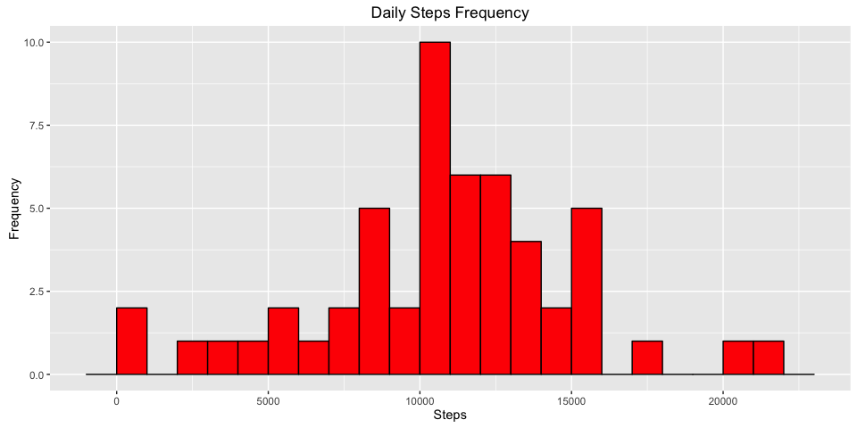
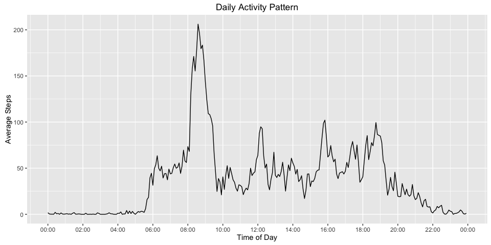
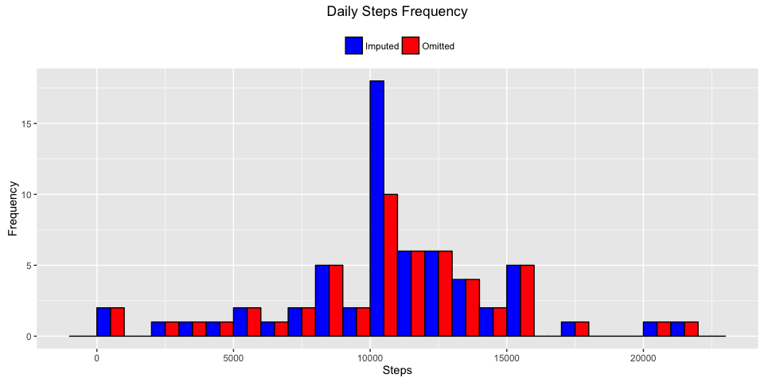
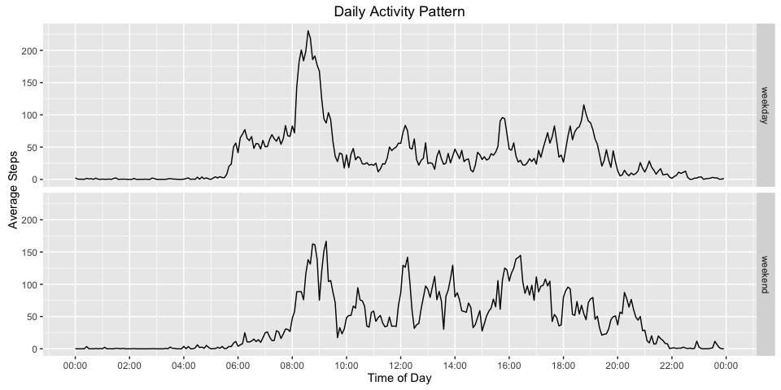

# Reproducible Research: Peer Assessment 1


```r
library(knitr)
library(dplyr)
library(ggplot2)
library(scales)

opts_chunk$set(message=FALSE, fig.path="figures/", fig.width=10, fig.lp = "Figure: ", fig.align = "center")
```

## Loading and preprocessing the data
First I load the activity data, specifying "NA" as missing values in the data;  
I cache these results for multiple later analysis

```r
url = "https://d396qusza40orc.cloudfront.net/repdata%2Fdata%2Factivity.zip"
destfile = "activity.zip"
datafile = "activity.csv"

get_data_set <- function() {
    
    if (class(try(nrow(trainDF), silent = T)) == "try-error") {
        
        if (!file.exists(datafile)) {
            
            if (!file.exists(destfile)) {
                
                print("Downloading data...")
                download.file(url = url, destfile = destfile, mode = "wb")
            }
            
            print("Extracting data...")
            unzip(destfile)
        }
    }
}

get_data_set()

dt = tbl_df(read.csv(datafile, na.strings = "NA"))

dt$date = as.Date(dt$date, "%Y-%m-%d")
```

## What is the mean total number of steps taken per day?
First the total number of steps per day are calculated, that is, all intervals are grouped by date and summed up, with missing intervals removed

```r
dts1 = dt %>%
    na.omit() %>%
    group_by(date) %>%
    summarise(total_steps_per_day = sum(steps)) %>%
    mutate(treatment = "omitted")
```
Then those total daily steps, with missing values removed, are used to plot the following histogram

```r
binwidth = 1000
print(ggplot(data = dts1, aes(x = total_steps_per_day)) +
          geom_histogram(binwidth = binwidth, color = "black", fill = "red") +
          labs(title = "Daily Steps Frequency", x = "Steps", y = "Frequency"))
```



A bin-width of 1000 steps is used as vaguely representative of 1km of walking/jogging/running (depending on height and stride of course); basically a very loose offering for a unit of activity to help distinguish between counts of more or less active days


```r
mean_total_steps_per_day = mean(dts1$total_steps_per_day)
median_total_steps_per_day = median(dts1$total_steps_per_day)
s1 = summary(dts1$total_steps_per_day, digits = ceiling(log10(max(dts1$total_steps_per_day))))
dfs1 = s1 %>% rbind(data.frame(), deparse.level = 0)
names(dfs1) = names(s1)
kable(dfs1, caption = "Table 1. Summary of total steps, with missing omitted")
```


Table: Table 1. Summary of total steps, with missing omitted

 Min.   1st Qu.   Median    Mean   3rd Qu.    Max.
-----  --------  -------  ------  --------  ------
   41      8841    10765   10766     13294   21194

The mean number of steps per day is 10766 (to the nearest whole step)  

The median number of steps per day is 10765 (to the nearest whole step)  

## What is the average daily activity pattern?

```r
dts2 = dt %>%
    na.omit() %>%
    mutate(time_of_day = as.character(strptime(sprintf("%04d", interval), "%H%M"))) %>%
    group_by(time_of_day) %>%
    summarize(ave_step_per_time_of_day = mean(steps))
```


```r
print(ggplot(data = dts2, aes(x = as.POSIXct(time_of_day), y = ave_step_per_time_of_day)) +
          geom_line() +
          scale_x_datetime(labels = date_format("%H:%M"), breaks = date_breaks("2 hours")) +
          labs(title = "Daily Activity Pattern", x = "Time of Day", y = "Average Steps"))
```




```r
dts2.1 = dts2 %>%
    filter(ave_step_per_time_of_day == max(ave_step_per_time_of_day)) %>%
    transmute(max_interval = as.numeric(strftime(time_of_day, "%H%M")), maximum_number_of_steps = ave_step_per_time_of_day) %>%
    head(1)

max_interval = dts2.1$max_interval
maximum_number_of_steps = dts2.1$maximum_number_of_steps
```
The maximum number of steps at 206.1698113 (averaged across all days) was during interval 835.

## Imputing missing values

```r
dts3 = dt %>%
    filter(is.na(steps)) %>%
    summarise(count = n())

number_of_missing_values = dts3$count
```
The total number of missing values in the dataset is 2304.

The impute strategy to fill in these missing values is to use the interval average (mean) calculated across all days i.e. the average of 0900 on day-1 and day-2 and so on will be used to fill missing 0900 intervals

```r
interval_means = setNames(as.numeric(dts2$ave_step_per_time_of_day), nm = strftime(dts2$time_of_day, "%H%M"))

dts3.1 = dt %>%
    group_by(interval) %>%
    mutate(steps = ifelse(is.na(steps), interval_means[sprintf("%04d", interval)], steps))

dts3.2 = dts3.1 %>%
    ungroup() %>%
    group_by(date) %>%
    summarise(total_steps_per_day = sum(steps)) %>%
    mutate(treatment = "imputed")
```


```r
print(ggplot(data = dts3.2, aes(x = total_steps_per_day)) +
          geom_histogram(binwidth = binwidth, color = "black", fill = "blue") +
          labs(title = 'Daily Steps (Imputed) Frequency', x = "Steps", y = "Frequency"))
```


```r
mean_total_imputed_steps_per_day = mean(dts3.2$total_steps_per_day)
median_total_imputed_steps_per_day = median(dts3.2$total_steps_per_day)
s2 = summary(dts3.2$total_steps_per_day, digits = ceiling(log10(max(dts3.2$total_steps_per_day))))
dfs2 = s2 %>% rbind(data.frame(), deparse.level = 0)
names(dfs2) = names(s2)
kable(dfs2, caption = "Table 2. Summary of total steps, with missing imputed")
```


Table: Table 2. Summary of total steps, with missing imputed

 Min.   1st Qu.   Median    Mean   3rd Qu.    Max.
-----  --------  -------  ------  --------  ------
   41      9819    10766   10766     12811   21194

The mean number of steps per day after imputing with interval means is 10766 (to the nearest whole step)  

The median number of steps per day after imputing with interval means is 10766 (to the nearest whole step)


```r
dts3.3 = bind_rows(dts1, dts3.2)

print(ggplot(data = dts3.3, aes(x = total_steps_per_day, fill = treatment)) +
          geom_histogram(binwidth = binwidth, colour="black", position="dodge") +
          scale_fill_manual(guide = "legend", breaks = c("imputed", "omitted"), values = c("blue", "red"), labels = c("Imputed", "Omitted")) +
          theme(legend.position = "top", legend.title = element_blank()) +
          labs(title = 'Daily Steps Frequency', x = "Steps", y = "Frequency"))
```


As shown by the comparative histogram, the results differ significantly at the 10,000 steps bucket; the rest of the daily activity frequencies remain the same.   

Where the histogram profiles are otherwise identical, it seems that the missing intervals are exclusive to previously unregistered days; further analysis is required to confirm this summation, as the contribution of imputed steps for a previously registered day may simply not have been enough to push that day into another bucket.  

## Are there differences in activity patterns between weekdays and weekends?


```r
weekends = c("Saturday", "Sunday")

dts4 = dts3.1 %>%
    ungroup() %>%
    mutate(weekday = factor(ifelse(weekdays(date) %in% weekends, "weekend", "weekday"))) %>%
    mutate(time_of_day = as.character(strptime(sprintf("%04d", interval), "%H%M"))) %>%
    group_by(weekday, time_of_day) %>%
    summarize(ave_step_per_time_of_day = mean(steps, na.rm = T))
```


```r
print(ggplot(data = dts4, aes(x = as.POSIXct(time_of_day), y = ave_step_per_time_of_day)) +
          geom_line() +
          facet_grid(weekday ~ .) +
          scale_x_datetime(labels = date_format("%H:%M"), breaks = date_breaks("2 hour")) +
          labs(title = "Daily Activity Pattern", x = "Time of Day", y = "Average Steps"))
```



On weekdays, there appears to be more activity in the morning, starting earlier at 6:00 AM and peaking higher at 8:30-9:00 AM.  
There then generally appears to be greater activity throughtout the weekend, until approximately 9:00 PM; however there is noticeable peak of evening activity on weekdays at around 7:00 PM.  
